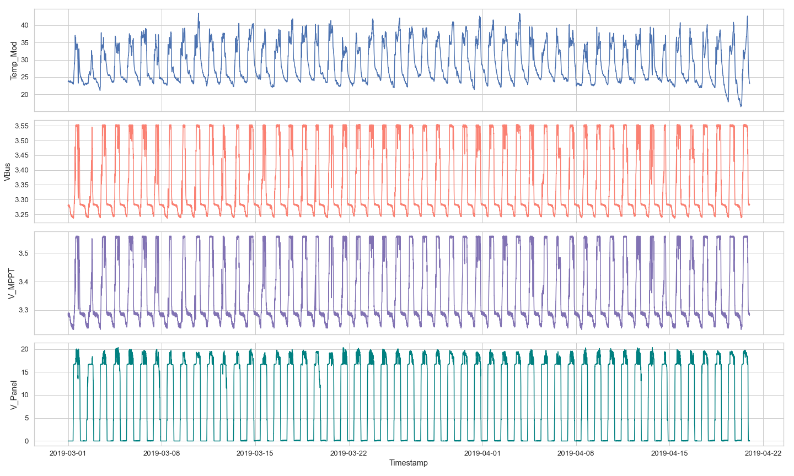

# WSN_energy_saving
Energy saving methods for WSNs.

## Data

In `Data/` is the data from the module used for making predictions.  There are 3 `.csv` files.

In `Vibration_data` is the vibration data

- 34.B2.9F.A9.csv contains the entire data from the module.
- Mod_5Min_resampled.csv is the same data resampled to 5 Minutes using the mean.
- Resampled_Shorted.csv is the data resampled to 5 Minutes using the mean, from 2018-10-01 to 2019-05-01, which was the period used in the paper. See next image.



If you want to use a different date range or sampling frequency, use the `34.B2.9F.A9.csv`. 

We only used 3 features: `Temp_Mod`, `V_MPPT` and `V_Panel`.

Otherwise just use `Resampled_Shorted.csv`, which is the same data we used in the paper.

The folder `Notebook` contains an example of how to import the data in python.

## Set up a Python environment

Run `conda env create` to create an environment called ` WSN_energy_saving`, as defined in `environment.yml`.
This environment will provide us with the right Python version as well as the CUDA and CUDNN libraries. (`conda env create -f environment.yml`)
We will install Python libraries using `pip-sync`, however, which will let us do three nice things:

Or you can run

```
conda env create --prefix ./env --file environment.yml
```

To create the environment as sub-directory

So, after running `conda env create`, activate the new environment and install the requirements:

```sh
conda activate MTS_WSN_Project or conda activate ./env
pip install -r requirements.txt
```

If you add, remove, or need to update versions of some requirements, edit the `.in` files, then run

```
pip-compile requirements.in && pip-compile requirements-dev.in
```
